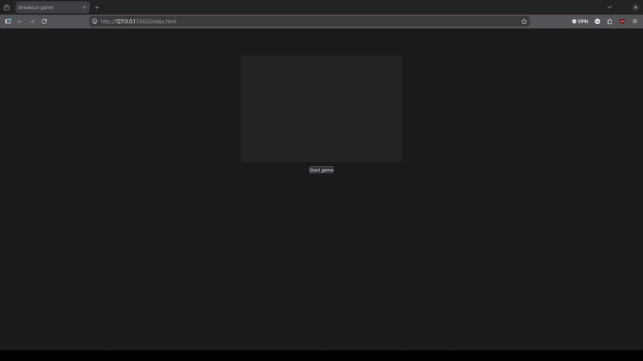

# Breakout Game

## Description
**breakout-game** is a 2D browser-based game where the player controls a paddle to bounce a ball 
and destroy bricks. The objective is to break all the bricks without letting the ball fall 
below the paddle.

This project is based on the Mozilla tutorial and was built as **learning project** to understand:
- HTML5 Canvas rendering
- Game loops and real-time interactions
- Collision detection and basic game logic

*Tutorial reference*: [Mozilla - Breakout Game Tutorial](https://developer.mozilla.org/en-US/docs/Games/Tutorials/2D_Breakout_game_pure_JavaScript)

## Table of contents
- [Features](#Features)
- [Technologies](#Technologies)
- [Installation](#Installation)
- [Usage](#Usage)

## Features
### Controls
- [X] Move the paddle using **left/right keys**
- [X] Move the paddle with the **mouse**

### Game logic
- [X] Start the game by clicking the **Start button**
- [X] Ball collides with bricks and destroy them
- [X] Score increases by **1 point per brick**
- [X] Win condition: all bricks are destroyed
- [X] Lose condition: the ball touches the bottom of the canvas

### Demo


## Technologies
- HTML5
- CSS3
- JavaScript (Vanilla)
- HTML5 Canvas API

## Installation
Clone the repository:
```based
git clone https://github.com/nateyang7/breakout-game.git
```

## Usage
1) Open the project folder
2) Launch `index.html` with a navigator of your choice like Chrome, Firefox or Safari.
3) Click **Start** or press **spacebar** to begin
4) Control the paddle using:
  - **Left/right** arrow keys
  - **Mouse**

## Project Structure
WIP

## Roadmap
WIP

## Learning Goals
This project focuses on:
- Canvas drawing and animation loops
- Event handling (keyboard & mouse)
- Collision detection
- Game state management

## Sources
- favicon: 

## Licence
This project is open-source and available under the MIT Licence.
